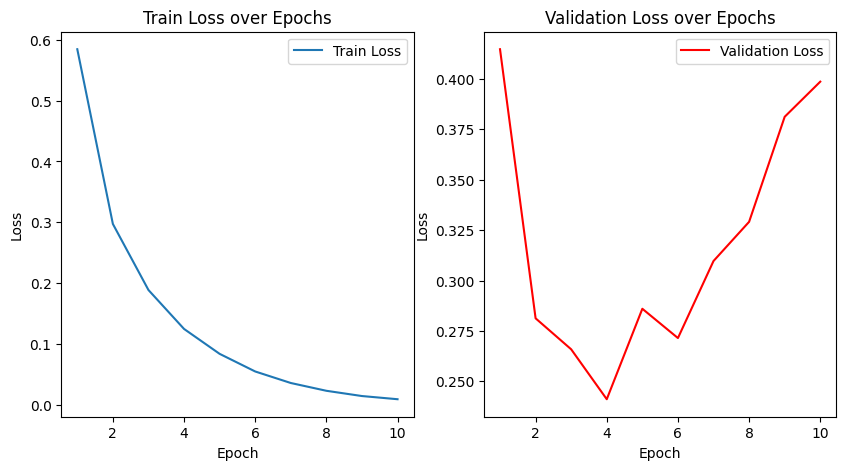
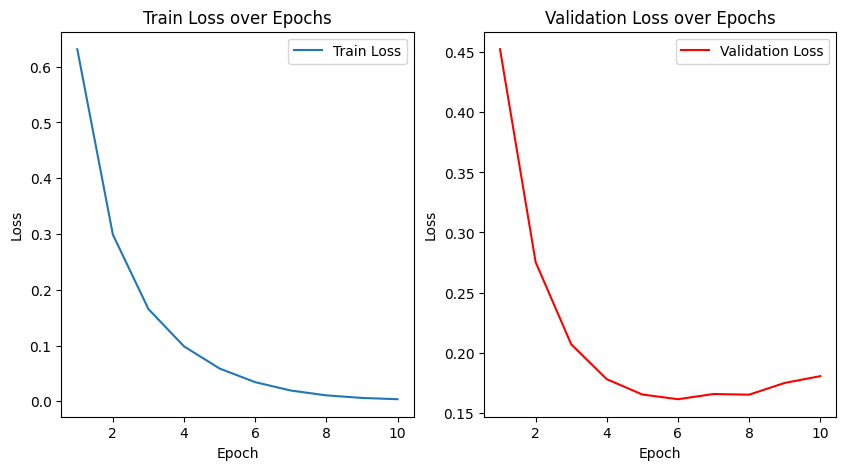
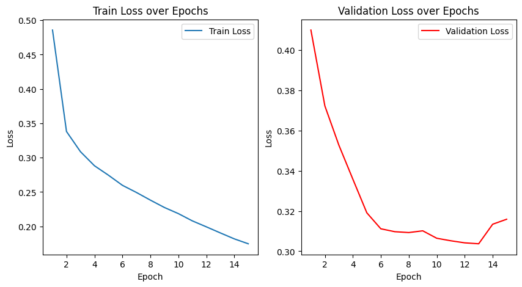
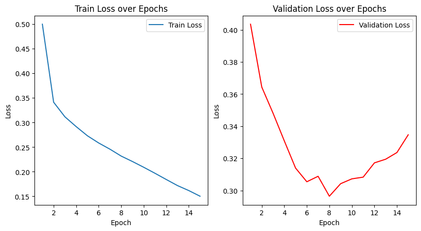

# Решение NER-задачи с использованием RNN | LSTM и Word2Vec

## Описание проекта
Данный проект посвящен построению и обучению модели для распознавания именованных сущностей (NER) с использованием RNN|LSTM-нейронной сети и предварительно обученных эмбеддингов Word2Vec. 
Основной целью проекта является улучшение точности распознавания сущностей путем интеграции предобученных эмбеддингов и анализа их влияния на модель.

### Постановка задачи
Создать модели на основе архитектур RNN и LSTM для задачи NER, обучить несколько моделей перебирая их гиперпараметры. В ходе эксперимента необходимо собрать основные метрики классификации,
 и оценить обученные модели. Так же необходимо реализовать возможность исследования созданной модели на новом предложении. 


## Структура проекта

1. **Построение и обучение модели**
   - Загрузка и подготовка данных для задачи NER (токены, метки сущностей).
   - Создание LSTM-модели с использованием созданных а затем предобученных эмбеддингов Word2Vec.
   - Заморозка весов эмбеддингов для предотвращения перенастройки и улучшения обобщающей способности.

2. **Анализ производительности**
   - Обучение модели на тренировочном наборе данных и оценка на валидационном.
   - Построение графиков потерь и метрик.
   - Сравнение результатов с использованием и без использования предобученных эмбеддингов.

3. **Эксперименты и доработки**
   - Применение техник регуляризации (Dropout).
   - Настройка гиперпараметров для улучшения обучения.

## Результаты работы
В ходе экспериментов модель обучалась на стандартном наборе данных для NER с использованием предобученных эмбеддингов Word2Vec. В результате были получены следующие метрики:

- Accuracy: 85.7%
- Precision: 80.5%
- Recall: 78.3%
- F1-score: 79.4%

Пример распознавания сущностей:

Для исходного предложения: "John lives in New York."

Мы получаем следующие результаты:

```
John: O
lives: O
in: O
New: B-LOC
York.: I-LOC
```

### Графики обучения

#### Обучение RNN модели на 10 эпохах


#### Обучение LSTM модели на 10 эпохах


#### Обучение RNN модели на 15 эпохах (в качестве эмбеддингов использовался w2v)


#### Обучение Bi-LSTM модели на 15 эпохах (в качестве эмбеддингов использовался w2v)



## Выводы на основе обучения модели

1) **RNN модель без w2v**:   
На 10-й эпохе потери на обучении составили 0.01, а потери на валидации увеличились до 0.40. Это говорит о том, что модель слишком хорошо подстроилась под обучающие данные, но не смогла обобщить на валидационных данных, что является признаком переобучения
2) **LSTM модель без w2v**:  
Потери на обучении снизились до 0.00 на 10-й эпохе, в то время как потери на валидации остались на уровне 0.18. Это также указывает на переобучение, так как модель демонстрирует отличные результаты на обучающем наборе, но не может поддерживать такую же производительность на валидационном
3) **RNN и LSTM модели с w2v**:  
Обе модели показывают более стабильные результаты с меньшими колебаниями потерь на валидации по сравнению с предыдущими запусками. Однако, если рассмотреть последние эпохи, можно заметить, что потери на валидации для RNN остаются примерно на уровне 0.31, а для LSTM — около 0.33. Это может указывать на то, что обе модели все еще могут быть подвержены переобучению, хотя и в меньшей степени

## Использованные библиотеки
Проект использует следующие библиотеки:

- `numpy`: для работы с массивами
- `pandas`: для обработки данных
- `torch` и `torch.nn`: для построения и обучения модели
- `gensim`: для загрузки предобученных эмбеддингов Word2Vec
- `matplotlib` и `seaborn`: для визуализации процесса обучения
- `scikit-learn`: для расчета метрик классификации

## Структура репозитория
- **NER_rnn_lstm.ipynb**: Jupyter Notebook с кодом для обучения и анализа модели
- **requirements.txt**: Файл со списком зависимостей для установки
- **images/**: Графики и метрики, полученные в ходе обучения

## Как использовать проект
1. Склонируйте репозиторий на свой компьютер
2. Установите необходимые зависимости, указанные в файле `requirements.txt`
3. Запустите Jupyter notebook `NER_rnn_lstm.ipynb`, следуя инструкции в нём

## Контактная информация
Если у вас есть вопросы или предложения по улучшению проекта, свяжитесь со мной:
- Email: maximgoltsov@gmail.com


